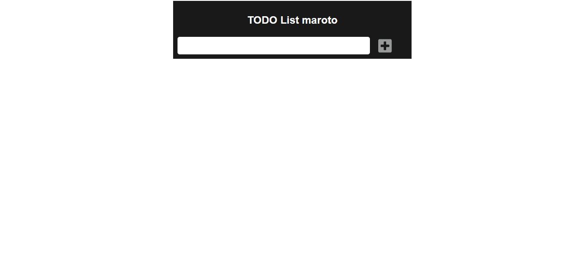

# TODO Laravel and Vue        



<br>
Just an app build with laravel, vue, sqlite!


How use it:

clone:      
``` 
git clone https://github.com/juststudies/TODO-List.git
```

Install:        
```
composer install 
```
and then:
```
npm install
```

To use as dev server:
```
php artisan serve
```
and then:
```
npm run hot
```

I'm using sqlite to tests, but you can change your database credentials em ```.env```, or is you want use sqlite, just create ```database.sqlite``` file inside ```database directory```

Thx to [Scrypster](https://www.youtube.com/channel/UCR1_G0EoEIb87wi3GPlk-CQ).